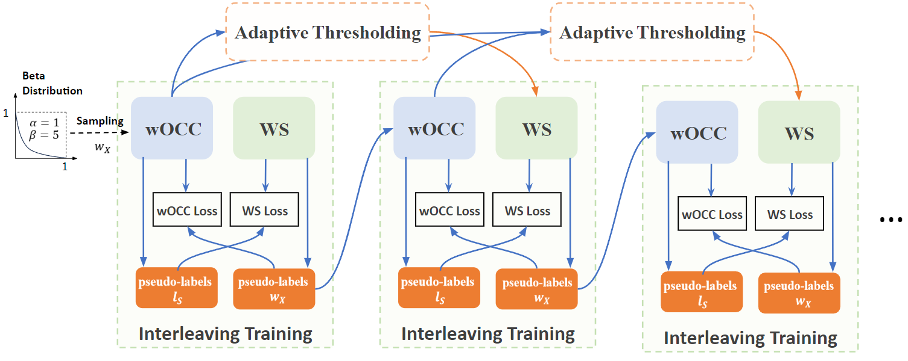

# Interleaving One-Class and Weakly-Supervised Models with Adaptive Thresholding for Unsupervised Video Anomaly Detection

The official PyTorch implementation of the paper "Interleaving One-Class and Weakly-Supervised Models with Adaptive Thresholding for Unsupervised Video Anomaly Detection".




## Getting Started

This code was tested on `Ubuntu 18.04.6 LTS` and requires:
* Python 3.8
* conda3 or miniconda3
* CUDA capable GPU

### Setup Conda Environment:
```
git clone https://github.com/benedictstar/Joint-VAD
cd Joint-VAD

# Conda environment setup
conda env create -f environment.yml
conda activate Joint
```

### Data Preparation
Since our work combines two open-source models [STG-NF](https://github.com/orhir/STG-NF) and [RTFM](https://github.com/tianyu0207/RTFM), you should organize the data following the guidance of each original repository.
- Pose data can be downloaded from this [link](https://drive.google.com/file/d/1o9h3Kh6zovW4FIHpNBGnYIRSbGCu-qPt/view?usp=sharing) in [STG-NF](https://github.com/orhir/STG-NF) and put them into `data/weakly_[dataset]/pose`. 
- I3D features for ShanghaiTech can be downloaded from this [link](https://drive.google.com/file/d/1-w9xsx2FbwFf96A1y1GFcZ3odzdEBves/view?usp=sharing) in [RTFM](https://github.com/tianyu0207/RTFM).
- I3D features for UBnormal can be downloaded from this [link](https://drive.google.com/file/d/1dHWrvO5ZDtmqvgqOpttRazI5HyxUAnQp/view?usp=sharing)
- Pretrained models can be downloaded from this [link](https://drive.google.com/file/d/156PJ5RAEnktab-ljWsXHhcJk77az-xIB/view?usp=sharing) and put them into `pretrained_models/`. (Some results can't match the results in our paper because the original pretrained weights are missing. We provide better results for reference.)

The following files need to be adapted in order to run the code on your own machine:
- Change the file paths to the download datasets above in `data/weakly_[dataset]/list/[dataset]-i3d-test-10crop.list` and `data/weakly_[dataset]/list/[dataset]-i3d-train-10crop.list`.

### Data Folder Structure
```
.
├── weakly_ShanghaiTech
│   ├── gt
│   │   └── test_frame_mask
│   ├── list
│   │   ├── gt-sh.npy
│   │   ├── make_gt_sh.py
│   │   ├── make_list_sh.py
│   │   ├── shanghai-i3d-test-10crop.list
│   │   ├── shanghai-i3d-train-10crop.list
│   │   └── test_frame_mask
│   ├── pose
│   │   ├── test
│   │   └── train
│   ├── shanghai-num.npy
│   └── SH_Train.txt
└── weakly_UBnormal
    ├── gt
    │   └── test_gt
    ├── list
    │   ├── gt-ub.npy
    │   ├── make_gt_ub.py
    │   ├── make_list_ub.py
    │   ├── ubnormal-i3d-test-10crop.list
    │   ├── ubnormal-i3d-train-10crop.list
    │   └── ubnormal-i3d-validation-10crop.list
    ├── pose
    │   ├── abnormal_train
    │   ├── test
    │   ├── train
    │   └── validation
    ├── ub-num.npy
    └── UB_Train.txt
```

## Training/Testing
Training and Evaluating is run using:
```
python main.py --dataset [ShanghaiTech\UBnormal] --ab_ratio [0.15\0.3] --seg_len [24\16]
```

Evaluation of our pretrained model can be done using:

STG-NF Model for ShanghaiTech:
```
python OCC_eval.py --dataset ShanghaiTech --Occ_checkpoint pretrained_models/SH_Occ_best_auc_in_UVAD_82.57.pth.tar
```
RTFM Model for ShanghaiTech:
```
python WS_eval.py --dataset ShanghaiTech --Weakly_pretrained_ckpt pretrained_models/SH_WS_best_auc_in_UVAD_88.52.pkl
```
STG-NF Model for UBnormal:
```
python OCC_eval.py --dataset UBnormal --seg_len 16 --Occ_checkpoint pretrained_models/UB_Occ_best_auc_in_UVAD_74.82.pth.tar
```
RTFM Model for UBnormal:
```
python WS_eval.py --dataset UBnormal --Weakly_pretrained_ckpt pretrained_models/UB_WS_best_auc_in_UVAD_63.26.pkl
```

## Acknowledgments
Our code is based on code from:
- [STG-NF](https://github.com/orhir/STG-NF)
- [RTFM](https://github.com/tianyu0207/RTFM)

